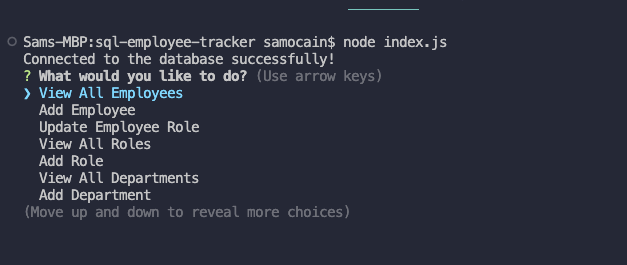

# SQL Employee Tracker

## Description

A command-line application to manage a company's database including Node.js, Inquirer, and MySQL

### User Story

- As a business owner, I want to be able to view and manage the departments, roles, and employees in my company so that I can organize and plan my business.

### What I Learned
- Continued practice with Node.js
- Use MySQL to connect to a database and give it CRUD functionality
- Set up a `.evn` environment to protect sensitive data and user information

## Table of Contents

- [Built Using](#built-using)
- [Installation](#installation)
- [Usage](#usage)
- [Screenshot](#screenshot)
- [Walkthrough](#walkthrough)
- [Credits](#credits)
- [License](#license)
- [Questions](#questions)
- [Socials](#socials)

## Built Using
 

## Installation

To test locally, you can clone this repo to your device and test in your own code editor and terminal. 
Please make sure Node.js has been installed. In your terminal/command line, run `npm i` or `npm install` to install the Node dependencies found in the `package.json` file.

For more information on Node.js and MySQL, please refer to:  

- https://nodejs.org/en/  
- https://www.mysql.com/

## Usage  

1. Clone the repo to your local environment to test the application
2. In your terminal or integrated terminal in your code editor, install the necessary dependencies found in the `package.json` file by typing `npm install`
3. Afterwards, type `node index.js` to start the application
4. From here, you will be prompted using Inquirer in the terminal from which you can then choose the desired action from the given list of choices
5. To quit the application at any time, simply press `ctrl + C` and begin again 

## Screenshot

## Walkthrough

[Walkthrough Demo Video](https://drive.google.com/file/d/151JgOPRuJRk8bJOraRbOwxx_eQOMwlsM/view)

## Credits

- Programming with Mosh (YouTube)
- Traversy Media
- CodeCademy
- Phillip Loy / EdX Tutoring 

## License

- This application is available to test and try locally. For any suggestions on improvements or new features, please see the links provided in the following section, or feel free to create a fork for this repo and submit a pull request.
- Sam O'Cain, 2023

## Questions

Email: [samocain93@gmail.com](mailto:samocain93@gmail.com)  

GitHub: [samocain93](https://github.com/samocain93)  

## Socials

